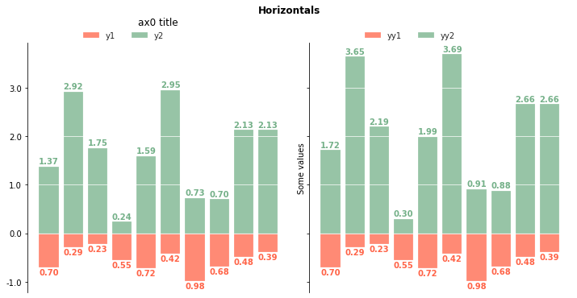
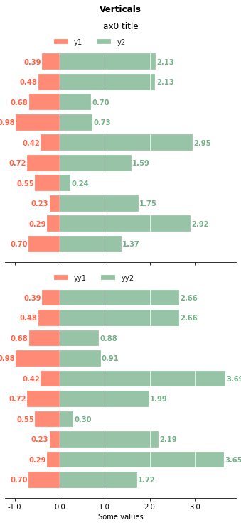

# Mirrored_Barplots
Bar plots for reflecting one or two paired series around the x=0 or y=0 axis.

# Examples:

* Simple mirrored paired series:  
  
  

* Double mirrored paired series:  
  
  

* Rougier-style, vertically mirrored categorical series:  
__This my functional implementation of the original [Rougier plot](https://journals.plos.org/ploscompbiol/article?id=10.1371/journal.pcbi.1003833) with added flexibility of annotation, including captioning.__
  
  

# Examples:  

See this [notebook](./notebooks/Mirrored_Barplots.ipynb) in the notebooks folder.
---
# TODO:  
 [ ] Redo caption placement for mpl_bachelors_caption_left.png
 [ ] add test mdl  
 [ ] pypi package  
 [ ] conda package  